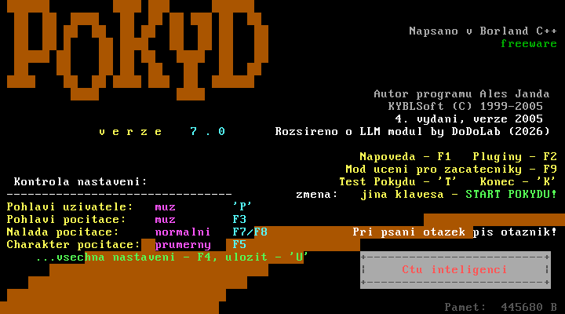
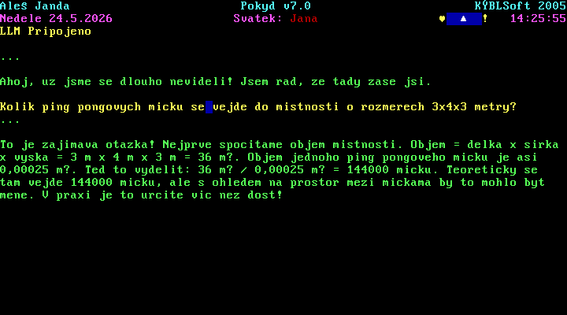

# Pokyd LLM

Pokyd je česká konverzační aplikace pro MS-DOS od **KýblSoftu**; tento repozitář jej rozšiřuje o napojení na LLM (OpenAI) prostřednictvím NodeJS bridge. 

Původní zdrojové kódy jsou [zde](https://old.kyblsoft.cz/iqpokyd)

Původní [README z roku 2002](./docs/pokyd_old.md)





## Struktura repozitáře

- `src/` – veškeré C zdrojáky, hlavičky a další fragmenty
- `assets/` – statická data (slovníky, doplňky)
- `scripts/` – pomocné skripty pro DOSBox-X, Windows a MacOS
- `bridge/` – Node.js server (LLM), viz [bridge/README.md](bridge/README.md)
- `POKYDLLM.BAT` – spuštění `pokyd.exe` s LLM uvnitř DOSBoxu (po `build-and-run-llm`)

---

## Co a jak nainstalovat

- **Open Watcom v2** (překladač pro DOS) - do složky watcom. Oficiální buildy: [Open Watcom v2 – Releases](https://github.com/open-watcom/open-watcom-v2/releases).
- **DOSBox-X** (DOS emulátor) - do složky dosbox. [DOSBox-X](https://dosbox-x.com/)
- Pro **LLM režim** navíc: **Node.js 18+**, API klíč a .env proměnné v `bridge/` (podrobnosti v [bridge/README.md](bridge/README.md)).


### MacOS

1. **DOSBox-X**  
   - Doporučeno: [Homebrew](https://brew.sh/) – `brew install dosbox-x`  
   - Nebo instalátor z webu; pokud binárka není v PATH, nastav proměnnou `NOTES_DOSBOX_X` na plnou cestu k spustitelnému souboru `dosbox-x`.

2. **Open Watcom**  
   - Stáhni snapshot pro macOS (archiv `.tar.xz` z výše uvedených releases).  
   - Rozbal například do **`/Users/<username>/watcom`** nebo přímo do **`/pokyd/watcom`**.  
   - Skript `build.sh` hledá překladač v tomto pořadí: proměnné **`WATCOM`**, pak **`./watcom`**, `~/watcom`, `/usr/local/watcom`, `/opt/watcom`. Uvnitř musí být například `binl64/wcl` nebo `binl/wcl` (záleží na architektuře).
   - Po rozbalení můžeš exportovat např.:  
     `export WATCOM=/cesta_k_watcom`

3. **Node.js** (jen pro LLM)  
   - např. `brew install node` nebo [nodejs.org](https://nodejs.org/).
   - zkopíruj `env.example` do `.env` a doplň parametry

4. **Watt-32** (jen pro LLM)  
   - Skript `build.sh` automaticky použije **`vendor/watt32-dos`**, pokud tam jsou hlavičky a knihovna (např. `inc/tcp.h`, `lib/wattcplf.lib`).  
   - Tyto soubory je možno vygenerovat pomocí Dockeru:  
     `./scripts/bootstrap-watt32-docker.sh`  
     (skript stáhne zdroje Watt-32 a zbuildí knihovnu pro Open Watcom).  

5. **Spuštění „vše v jednom“ s LLM (macOS/Linux)**  
   - Po splnění výše uvedeného (včetně doplnění parametrů do `bridge/.env`), spusť:  
     `./build-and-run-llm.sh`

### Windows

1. **Open Watcom**  
   - Z [releases](https://github.com/open-watcom/open-watcom-v2/releases) stáhni snapshot pro **Windows** (instalátor nebo ZIP podle nabídky).  
   - Rozbal obsah tak, aby existovala cesta  
     **`pokyd\watcom\binnt\wcl.exe`**  
   - `build.bat` očekává přesně tuto strukturu

2. **DOSBox-X**  
   - **Bez LLM:** stačí běžná VS instalace (např. `dosbox\x64\Release\dosbox-x.exe` nebo portable VS build).  
   - **S LLM:** potřebuješ **MinGW win64** build se **slirp** backendem (NE2000). Visual Studio build v `dosbox\` síť neumí — skript `run-dosbox.ps1` / `build-and-run-llm.bat` stáhne MinGW automaticky do **`.tools\dosbox-x-mingw\`**, pokud tam ještě není.  
   - Volitelně nastav cestu k MinGW `dosbox-x.exe` do **`NOTES_DOSBOX_X`** (musí podporovat slirp).

3. **Node.js** (jen pro LLM bridge na stejném PC)  
   - Instalace z [nodejs.org](https://nodejs.org/) (LTS). V adresáři `bridge` spusť `npm install`, zkopíruj`.env.example` do souboru `.env` a uprav parametry – viz [bridge/README.md](bridge/README.md).

4. **Watt-32** (jen pro LLM)  
   - Stejně jako na macOS/Linux: `build.bat` automaticky zapne LLM režim, pokud existuje **`vendor\watt32-dos`** s hlavičkami a knihovnou (např. `inc\tcp.h`, `lib\wattcplf.lib` nebo `lib\wattcpwl.lib`).  
   - Adresář **`vendor\watt32-dos`** vygeneruj jednorázově přes Docker:  
     `scripts\bootstrap-watt32-docker.bat`  

5. **Spuštění „vše v jednom“ s LLM (Windows)**  
   - Po bootstrapu Watt-32 a doplnění `bridge\.env` spusť:  
     `build-and-run-llm.bat`


## Sestavení a spuštění

### Windows

Z kořene repozitáře:

```bat
build-and-run.bat
```

Postup:

1. Sestaví `pokyd.exe` ze `src/pokyd.c` pomocí Open Watcom (`watcom\binnt\wcl.exe`).
2. Spustí DOSBox-X a naběhne `pokyd.exe`.

Jen překlad:

```bat
build.bat
```

LLM režim (Watt-32 + Node most + NE2000 v DOSBox-X) – vše najednou:

```bat
build-and-run-llm.bat
```

**Znovu spustit Pokyd s LLM uvnitř DOSBoxu** (po ukončení hry, na výzvě `C:\>`):

- Bridge na hostiteli musí stále běžet (spouští ho `build-and-run-llm.bat`, nebo ručně `node bridge\server.js`).
- V DOSBoxu zadej:

```text
POKYDLLM
```

Soubor [`POKYDLLM.BAT`](POKYDLLM.BAT) v kořeni repozitáře (v DOSu `C:\POKYDLLM.BAT`) spustí `pokyd.exe -consplit -llm 10.0.2.2 8765`. Samotné `pokyd.exe` LLM nezapne – je potřeba přepínač `-llm`. Pokud máš jiný port než 8765, uprav v batch souboru řádky `POKYD_LLM_IP` / `POKYD_LLM_PORT` (stejně jako `BRIDGE_PORT` v `bridge\.env`).

Podrobnosti k síti, `WATTCP.CFG` a `assets\NE2000.COM`: [bridge/README.md](bridge/README.md).

### MacOS

Z kořene repozitáře:

```bash
./build-and-run.sh
```

Postup:

1. Sestaví `pokyd.exe` a `slova.exe` pomocí hostitelských nástrojů Open Watcom (viz výše).
2. Spustí DOSBox-X a `pokyd.exe`.

Jen překlad:

```bash
./build.sh
```

LLM režim (Watt-32 + Node most + NE2000 v DOSBox-X) – vše najednou:

```bash
./build-and-run-llm.sh
```

**Znovu spustit Pokyd s LLM uvnitř DOSBoxu** (na výzvě `C:\>`): bridge na hostiteli musí běžet, pak v DOSu `POKYDLLM` (soubor `POKYDLLM.BAT` v kořeni repozitáře). Viz výše u Windows.

---

## Konfigurovatelné proměnné

Konfigurační soubor hry je v souboru `POKYD.CFG`. V LLM módu jej hra odesílá na server při každém dotazu.

| Proměnná | Výchozí | Účel |
|----------|---------|----------------|
| `BRIDGE_PORT` | `8765` (nebo z `bridge/.env`) | Port nodejs middleware co posílá LLM data |
| `POKYD_LLM_IP` | `10.0.2.2` | Adresa bridge **z pohledu DOS hosta**  |
| `POKYD_LLM_PORT` | jako `BRIDGE_PORT` | TCP port, na který se `pokyd.exe` připojí (`-llm=`) |
| `POKYD_LLM_HOST` | odvozené `IP:port` | Argument `-llm=host:port` (má prioritu nad `IP`+`PORT`) |
| `POKYD_DOSBOX_CPU_CORE` | `dynamic` při LLM | Nastavení DOSBox-X `[cpu] core=` |
| `NOTES_DOSBOX_X` | — | Plná cesta k `dosbox-x` / `dosbox-x.exe` |

**Při sestavení** (`build.sh` / `build.bat` s Watt-32): pokud je nastaveno `POKYD_LLM_IP` a/nebo `POKYD_LLM_PORT` (nebo `BRIDGE_PORT` na Windows), zapíší se výchozí hodnoty do `pokyd.exe` (přepíše je runtime `-llm=host:port`).

**Příklady:**

```bash
# macOS/Linux – vlastní port bridge i Pokyd
export BRIDGE_PORT=9000
export POKYD_LLM_IP=10.0.2.2
./build-and-run-llm.sh
```

```bat
rem Windows – stejné názvy
set BRIDGE_PORT=9000
set POKYD_LLM_IP=10.0.2.2
build-and-run-llm.bat
```

```bash
# Jen spuštění DOSBox s LLM (bridge už běží na hostu)
POKYD_LLM_HOST=10.0.2.2:8765 ./build-and-run.sh
```

Podrobnosti k protokolu a Watt-32: [bridge/README.md](bridge/README.md).

---

## Dokumentace pro AI agenty

- **[docs/prd.md](docs/prd.md)** – požadavky, rozsah, kritéria akceptace  
- **[docs/CODEMAP.md](docs/CODEMAP.md)** – pořadí `#include` fragmentů a mapa subsystémů  
- **[AGENTS.md](AGENTS.md)** – rozcestník
- **[bridge/README.md](bridge/README.md)** – protokol TCP, Node bridge, OpenAI, `.env`  
- **[.cursor/rules/](.cursor/rules/)** – pravidla pro architekturu, DOS/font, Watcom 
- **`scripts/pokyd_add_fn_comments.py`** – pomůcka pro komentáře u funkcí

---
